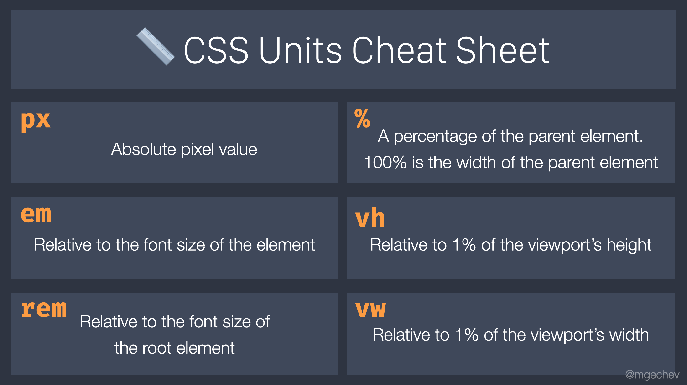

June 2 ~ HTML/CSS
============================

<iframe src="https://docs.google.com/presentation/d/e/2PACX-1vSe-gYzx0WAKM5NExUllUjfU7jb_UWh9iv3QMSjrrWe-Fu7IJo--95pn95XcbI3sy7avcS8A8US3Je5/embed?start=false&loop=false&delayms=5000" frameborder="0" width="754" height="400" allowfullscreen="true" mozallowfullscreen="true" webkitallowfullscreen="true"></iframe>

- [How To Build a Website with HTML](https://www.digitalocean.com/community/tutorial_series/how-to-build-a-website-with-html)

- [How to Build a Website with CSS](https://www.digitalocean.com/community/tutorial_series/how-to-build-a-website-with-css)

## CSS Games 

- [CSS Diner](http://flukeout.github.io/)
- [Flexbox Froggy](https://flexboxfroggy.com/)
- [Flexbox Defense](http://www.flexboxdefense.com/)
- [Grid Garden](https://cssgridgarden.com/)
([src](https://twitter.com/girl_whocode/status/1392714963039383554?s=21))  

 

